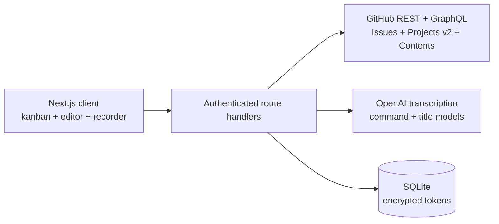

<div align="center">
  
  <h1>Git Master</h1>
  <p><strong>Керування GitHub-задачами та проєктами з голосом на першому місці.</strong></p>
  <p>Скажіть. Відредагуйте. Опублікуйте.</p>
</div>

<p align="center">
  <a href="README.md">English</a> | <strong>Українська</strong>
</p>

Git Master — це open-source інструмент для самостійного розгортання, який дає змогу створювати, редагувати, коментувати й переміщувати GitHub Issues без зайвої навігації. Продиктуйте один фрагмент, введіть наступний, прикріпіть скриншот і продовжуйте говорити — редактор збереже наявний вміст і вставить кожну транскрипцію в позицію курсора.

## Що вже працює

- Підключення GitHub-акаунта, організації або окремого репозиторію
- Дошки GitHub Projects v2 із реальним полем Status
- Резервна kanban-дошка для репозиторію на основі міток `status: ...`
- Створення, редагування та остаточне видалення issues; керування мітками, станом, статусом і Markdown-описом
- Створення й редагування коментарів із текстом, голосовими фрагментами, зображеннями та іншими файлами
- Додавання вкладень перетягуванням, через системний вибір файлів або вставленням зображення з clipboard
- Вставлення кількох голосових фрагментів точно в позицію курсора
- Автоматичне створення назви issue з опису зі збереженням його мови
- Українські, англійські та змішані українсько-англійські команди й диктування
- Налаштовувані гарячі клавіші з режимами push-to-talk і запису без утримування
- Зашифроване зберігання токенів, пароль із env, підписані сесії, обмеження частоти входу й security headers
- Інтерактивна демодошка до підключення GitHub
- Docker, SQLite, CI, unit/integration-тести та браузерні Playwright-тести

## Як користуватися Git Master

### Повний сценарій створення задачі голосом

1. Підключіть GitHub-акаунт, організацію або окремий репозиторій і виберіть потрібний репозиторій. Якщо для нього доступний GitHub Project, виберіть також проєкт — дошка покаже його реальні колонки Status.
2. Відкрийте редактор кнопкою **Нова задача**, клавішами **Alt+N** або голосовою командою `Відкрий нову задачу` через **Alt+V**.
3. Коли редактор відкритий, знову натисніть **Alt+V** і продиктуйте перший фрагмент опису. Повторюйте це скільки завгодно разів — кожна транскрипція додаватиметься до наявного тексту, а не замінюватиме його.
4. Між голосовими фрагментами можна вводити чи редагувати Markdown, задавати заголовок, вибирати мітки й статус, додавати зображення та інші файли.
5. Скажіть `Збережи і закрий задачу`, щоб створити чи оновити issue. Якщо нова задача не має заголовка, Git Master згенерує коротку назву з контексту опису.
6. Задача одразу з'явиться на дошці без ручного оновлення сторінки. Скажіть `Скасуй задачу` або `Закрий без збереження`, щоб відкинути чернетку.

Увесь цикл можна пройти однією гарячою клавішею:

```text
Alt+V -> «Відкрий нову задачу»
Alt+V -> «Потрібно додати валідацію форми реєстрації»
Alt+V -> «Also cover the GitHub retry flow після expired token»
Alt+V -> «Збережи і закрий задачу»
```

### Як Alt+V працює в різних контекстах

| Контекст | Поведінка |
| --- | --- |
| Дошка, редактор закритий | Розпізнає команди створення, пошуку, редагування, видалення, перенесення й оновлення |
| Редактор нової чи наявної задачі | Вставляє звичайне мовлення в опис як новий фрагмент |
| Редактор і явна команда заголовка, опису чи коментаря | Застосовує продиктований текст до відповідного поля |
| Редактор і явна команда збереження | Зберігає issue в GitHub і закриває редактор |
| Редактор і явна команда скасування | Закриває редактор без збереження чернетки |

Ця поведінка навмисно залежить від контексту. Фраза `Додай можливість вибрати organization` у відкритому редакторі є текстом задачі. Дією вона стає лише як коротка й однозначна команда: наприклад, `Збережи задачу` або `Скасуй задачу`.

### Голосові команди

Команди можна говорити українською, англійською або змішувати обидві мови в одному реченні.

| Дія | Приклади |
| --- | --- |
| Створити задачу | `Відкрий нову задачу`, `Створи новий таск`, `Create new issue` |
| Відкрити issue для редагування | `Редагувати задачу 432`, `Правити таск #432`, `Змінити ішю 432`, `Edit issue 432` |
| Видалити issue | `Видалити задачу 432`, `Знищити таск 432`, `Delete issue 432`, `Remove task 432` |
| Перенести між колонками | `Перенести задачу 432 з In progress у Review`, `Move issue 432 from Review to Done`, `Move task 432 to Backlog` |
| Встановити заголовок | `Встанови заголовок Додати кешування профілю`, `Set title to Fix broken login` |
| Додати до опису | `Додай в опис критерії приймання`, `Append to description add retry handling` |
| Підготувати коментар | `Додай коментар перевірено на staging`, `Add comment ready for review` |
| Зберегти й закрити | `Збережи задачу`, `Додай цей task`, `Закрити та додати завдання`, `Save this issue` |
| Скасувати | `Скасуй задачу`, `Відмінити завдання`, `Закрий без збереження`, `Close without saving` |
| Знайти задачі | `Знайди задачі авторизація`, `Search issues token refresh` |
| Оновити дошку | `Онови дошку з задачами`, `Refresh board` |

Для Edit, Delete і Move номер означає GitHub issue number, а не порядкове місце картки. У відкритому редакторі номер можна не казати в командах видалення й перенесення. Перенесення перевіряє початкову колонку, якщо її названо, і використовує точні Status-колонки активної дошки. Голосове видалення лише відкриває підтвердження незворотної операції — задача ніколи не видаляється мовчки.

У **Налаштування -> Голосові команди** можна змінити дієслова для редагування, видалення й перенесення, а також власні назви сутності задачі. Розділяйте варіанти комами або новими рядками. Власні команди зберігаються в `localStorage` поточного браузера; кнопка **Відновити типові** повертає стандартні українські та англійські синоніми.

### Push-to-talk і гарячі клавіші

- Утримуйте **Alt+V**, говоріть і відпустіть клавіші, щоб завершити запис та виконати команду або вставити транскрипцію — як у рації.
- Двічі швидко натисніть **Alt+V**, щоб запис продовжувався без утримування. Наступне одинарне або подвійне натискання зупинить його.
- Натисніть **Alt+N**, щоб відкрити нову задачу в активному репозиторії.
- Відкрийте **Налаштування -> Гарячі клавіші**, щоб змінити обидві комбінації. Налаштування зберігаються локально в поточному браузері.
- Комбінація без Ctrl, Alt, Shift або Meta не перехоплюється під час набору в input, textarea, select чи editable-полі, тому не заважає звичайному введенню.

Кнопка **Голос** усередині заголовка, опису або коментаря працює лише для відповідного поля й вставляє транскрипцію в позицію курсора. Так один документ можна природно складати з кількох голосових фрагментів, ручного тексту й вкладень.

### Задачі й коментарі

- Нові issues підтримують Markdown, мітки, стан, Project Status і вкладення. Після створення локальна дошка оновлюється одразу.
- Наявний issue можна відкрити з дошки, змінити голосом або текстом, додати файли й зберегти назад у GitHub.
- Кнопка **Видалити** остаточно видаляє issue через GitHub після явного підтвердження. Підключений користувач повинен мати необхідні права.
- Коментарі можна створювати й редагувати. Ручний текст, голосові фрагменти, зображення та інші файли можна додавати в довільному порядку.
- Кожен редактор із вкладеннями приймає перетягування файлів, кнопку **Вибрати файли** та вставлення зображень із clipboard через **Ctrl+V** або **Command+V**. Звичайний текст із clipboard залишається текстом.

## Швидкий запуск із Docker

Вимоги: Docker 24+ і GitHub personal access token.

```bash
git clone https://github.com/AgencyAI-one/GIT_Master.git
cd GIT_Master
cp .env.example .env
openssl rand -hex 32 # використайте як ENCRYPTION_KEY
openssl rand -base64 48 # використайте як APP_SECRET
docker compose up --build
```

Відкрийте [http://localhost:3000](http://localhost:3000) і увійдіть із `APP_PASSWORD` із файлу `.env`. Додайте `OPENAI_API_KEY`, щоб увімкнути транскрипцію, контекстне створення заголовків та інтерпретацію команд природною мовою. Основне керування GitHub працює і без нього.

## Локальна розробка

```bash
npm install
cp .env.example .env.local
npm run dev
```

Щоб запустити dev-сервер на порту 5173:

```bash
npm run dev -- --port 5173
```

Потрібен Node.js 22+; у Docker і CI використовується Node.js 24. Тільки в development-режимі Git Master використовує резервний пароль `gitmaster`. Production не запуститься без `APP_PASSWORD`, `APP_SECRET` довжиною щонайменше 32 символи та `ENCRYPTION_KEY`.

## Запуск, зупинка, перезапуск і логи

Скрипти в корені керують одним локальним процесом Git Master і типово використовують порт `5173`:

```bash
./start.sh dev       # Next.js dev-сервер із hot reload
./start.sh prod      # збірка й запуск оптимізованого production-сервера
./stop.sh
./restart.sh         # зберегти поточний режим і порт
./restart.sh prod    # перейти в production-режим
./logs.sh            # показати останні 100 рядків і стежити за новими
./logs.sh --no-follow 50
```

Другим аргументом можна вказати інший порт, наприклад `./start.sh dev 3000`. Ті самі типові значення налаштовуються через `GIT_MASTER_MODE`, `GIT_MASTER_PORT` і `GIT_MASTER_HOST`. Runtime PID, режим, порт і логи зберігаються в ігнорованій директорії `.git-master-runtime/`. Перед надсиланням сигналу `stop.sh` перевіряє, що збережений PID належить саме цьому checkout.

Production-режим завжди виконує `npm run build`, копіює `public` і статичні ресурси в standalone-збірку Next.js та запускає `.next/standalone/server.js`. Тому запуск одразу завершується помилкою, якщо застосунок або обов'язкове production-середовище невалідні. Перед використанням додайте безпечні `APP_PASSWORD`, `APP_SECRET` і `ENCRYPTION_KEY` у `.env`.

## Доступ до GitHub

Git Master навмисно починає з personal access token замість обов'язкового OAuth app. Це спрощує самостійне розгортання та підтримує три типи підключення з одного інтерфейсу:

| Підключення | Видимі репозиторії | Рекомендований scope токена |
| --- | --- | --- |
| Акаунт | Репозиторії, доступні токену | Виберіть лише потрібні репозиторії |
| Організація | Репозиторії однієї організації | Виберіть організацію й потрібні репозиторії |
| Репозиторій | Рівно один репозиторій | Виберіть один репозиторій |

Для fine-grained token надайте:

- Metadata: read
- Issues: read and write
- Contents: read and write — потрібно лише для вкладень
- Projects: read and write — потрібно лише для синхронізації статусів Projects v2

Organization Projects також можуть вимагати схвалення організації. Classic tokens потребують `repo`, а за потреби також `read:org` і `project`. Завжди надавайте токену мінімально необхідні права.

## Вкладення

GitHub не має публічного endpoint для завантаження вкладень до issue. Натомість Git Master використовує підтримуваний Contents API:

1. Створює або визначає issue.
2. Комітить файл у `.git-master/uploads/issue-<number>/`.
3. Вставляє отримане посилання на зображення чи файл в issue або коментар як Markdown.

Так вкладення залишаються доступними в самому GitHub і зберігаються в історії репозиторію. Кожне завантаження створює невеликий commit. Встановіть `GITHUB_UPLOAD_BRANCH`, якщо вкладення мають потрапляти в іншу гілку.

Кожен редактор із підтримкою вкладень — опис issue, новий коментар і редагування наявного коментаря — приймає файли трьома способами:

- Перетягніть один або кілька файлів на редактор і відпустіть їх у підсвіченій області.
- Натисніть **Вибрати файли** й виберіть один або кілька файлів через системний діалог.
- Скопіюйте зображення чи скриншот і натисніть **Ctrl+V** або **Command+V**, коли потрібний редактор у фокусі.

Обробник clipboard приймає лише зображення, тому вставлений текст поводиться звичайним для браузера чином. Вибрані файли відображаються під редактором із назвою та розміром, і їх можна прибрати до збереження. Дублікати ігноруються, а ліміт 10 МБ перевіряється одразу.

## Видалення задач і редагування коментарів

Для видалення issue використовується GraphQL-мутація GitHub `deleteIssue`; у drawer потрібно явно підтвердити операцію. Видалення остаточне й виконується лише тоді, коли підключена GitHub-ідентичність має відповідний дозвіл. Файли, раніше закомічені в `.git-master/uploads/`, залишаються в історії репозиторію.

Коментарі редагуються через GitHub endpoint оновлення issue comment. GitHub дозволяє це автору коментаря або користувачеві з достатніми правами на запис у репозиторій. Наявний текст коментаря можна змінити, доповнити голосом і додати до нього нові вкладення.

## Голос і підтримка мов

Плаваючий мікрофон оптимізований для української, англійської та змішаної українсько-англійської мови розробників. Мова визначається автоматично, а prompt транскрипції допомагає зберігати технічні терміни, назви продуктів, файлів і code identifiers.

Поза редактором issue мікрофон слухає команди. Коли нову або наявну задачу відкрито, звичайне мовлення додається до опису, тому тією самою комбінацією **Alt+V** можна вставити скільки завгодно послідовних фрагментів. Явні команди збереження, скасування, заголовка, опису й коментаря залишаються доступними.

Типова модель транскрипції — `gpt-4o-mini-transcribe`; її можна змінити через `OPENAI_TRANSCRIBE_MODEL`. Для голосових функцій потрібен `OPENAI_API_KEY`. У документі [Вибір голосової моделі](docs/VOICE.md) наведено порівняння ціни та якості й описано вибір точнішої моделі.

## Архітектура



Лише сервер має доступ до GitHub- і AI-credentials. Докладніше: [Архітектура](docs/ARCHITECTURE.md), [Безпека](docs/SECURITY.md) і [Голос](docs/VOICE.md).

## Конфігурація

| Змінна | Обов'язкова | Призначення |
| --- | --- | --- |
| `APP_PASSWORD` | У production | Спільний пароль приватного workspace |
| `APP_SECRET` | У production | HMAC-секрет сесії, щонайменше 32 символи |
| `ENCRYPTION_KEY` | У production | Рекомендовано 64 шістнадцяткові символи; шифрує GitHub-токени |
| `DATABASE_PATH` | Ні | SQLite-файл; типово `./data/git-master.db` |
| `OPENAI_API_KEY` | Для голосу та AI | Серверний OpenAI API key |
| `OPENAI_TRANSCRIBE_MODEL` | Ні | Типово `gpt-4o-mini-transcribe` |
| `OPENAI_TEXT_MODEL` | Ні | Типово `gpt-4o-mini`; використовується для заголовків і маршрутизації команд |
| `GITHUB_API_URL` | Ні | Типово `https://api.github.com`; підтримує GitHub Enterprise API roots |
| `GITHUB_UPLOAD_BRANCH` | Ні | Гілка для комітів із вкладеннями |

## Перевірка

```bash
npm run lint
npm run typecheck
npm test
npm run test:e2e
npm run build
```

`npm run check` запускає lint, перевірку типів, unit/integration-тести та production-збірку. Playwright запускається окремо, оскільки потребує браузерних binaries: `npx playwright install chromium`.

## API

Усі routes, крім `/api/health` і `/api/auth/login`, вимагають підписану сесію застосунку.

| Область | Routes |
| --- | --- |
| Автентифікація | `/api/auth/login`, `/api/auth/logout` |
| Підключення | `/api/connections`, `/api/connections/:id` |
| Workspace | `/api/github/repositories`, `/projects`, `/board`, `/status` |
| Issues | `/api/github/issues`, `/issues/:number`, `/issues/:number/comments`, `/issues/:number/comments/:commentId` |
| Файли | `/api/github/attachments` |
| Голос | `/api/voice/transcribe`, `/title`, `/command` |

## Стан проєкту

Це перша production-ready основа, а не hosted SaaS. Поточна модель автентифікації навмисно використовує один пароль приватного workspace. Облікові записи кількох користувачів, встановлення GitHub App/OAuth, часткові транскрипції в реальному часі через WebSocket і S3-сумісне сховище вкладень — задокументовані кандидати roadmap, а не приховані незавершені функції.

Ми раді внескам у проєкт. Прочитайте [CONTRIBUTING.md](CONTRIBUTING.md), [Кодекс поведінки](CODE_OF_CONDUCT.md) і [Політику безпеки](SECURITY.md).

## Ліцензія

[MIT](LICENSE) © 2026 AgencyAI-one та учасники Git Master.
