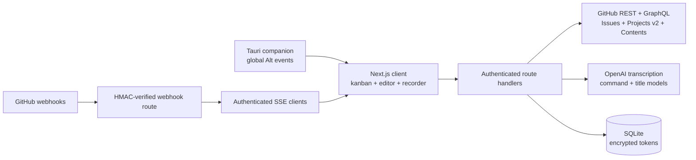

<div align="center">
  
  <h1>Git Master</h1>
  <p><strong>Voice-first GitHub issue and project management.</strong></p>
  <p>Say it. Edit it. Ship it.</p>
</div>

<p align="center">
  <strong>English</strong> | <a href="README-UA.md">Ukrainian translation</a>
</p>

Git Master is an open-source, self-hosted workspace for creating, editing, commenting on, and moving GitHub issues without losing time to navigation. Dictate one fragment, type the next, attach a screenshot, then continue speaking—the editor preserves the existing content and inserts each transcript at the caret.

## What works

- GitHub account, organization, and single-repository connections
- GitHub Projects v2 boards with their real Status field
- Drag cards to reorder them within a column or place them precisely in another column
- Repository-only kanban fallback backed by `status: ...` labels
- Create, edit, and permanently delete issues; manage labels, state, status, and Markdown body
- Create and edit comments with text, voice fragments, images, and other files
- Add attachments by drag and drop, file picker, or clipboard image paste
- Insert multiple voice fragments exactly at the current caret
- Generate issue titles from the description while preserving its language
- Use Ukrainian, English, or mixed Ukrainian-English commands and dictation
- Use one-key **Alt** push-to-talk in the focused web app or globally through the optional Tauri desktop companion
- Receive event-driven GitHub board updates through signed webhooks and SSE, without continuous polling
- Hand `Ready` issues to Codex CLI or Claude Code through the companion [AI Git Task Processing Skills](https://github.com/AgencyAI-one/ai-git-task-processing-skills)
- Store tokens encrypted and protect the app with an environment-based password, signed sessions, login rate limiting, and security headers
- Explore an interactive demo board before adding a GitHub connection
- Run with Docker and SQLite; validate with CI, unit/integration tests, and Playwright browser tests

## Using Git Master

### Create an issue by voice

1. Connect a GitHub account, organization, or repository and select the target repository. If a GitHub Project is available, select it to display its real Status columns.
2. Open the issue editor with **New issue**, **Alt+N**, or a voice command such as `Create a new issue` through **Alt**.
3. With the editor open, press **Alt** again and dictate the first part of the description. Repeat as often as needed—each transcript is added to the existing text instead of replacing it.
4. Between voice fragments, type or edit Markdown, set a title, choose labels and status, and attach images or other files.
5. Say `Save and close the issue` to create or update it. If a new issue has no title, Git Master generates a short contextual title from its description.
6. The issue appears on the board immediately, without a page refresh. Say `Cancel the issue` or `Close without saving` to discard the draft.

The entire flow can use one shortcut:

```text
Alt -> "Create a new issue"
Alt -> "Add validation to the registration form"
Alt -> "Also cover the GitHub retry flow after an expired token"
Alt -> "Save and close the issue"
```

### How Alt behaves

| Context | Behavior |
| --- | --- |
| Board with no editor open | Interprets commands such as create, find, edit, delete, move, or refresh |
| New or existing issue editor | Inserts ordinary speech into the description as a new fragment |
| Comments tab or an existing comment editor | Inserts ordinary speech into the active new or existing comment |
| Editor with an explicit title, description, or comment command | Applies the requested content to that field |
| Editor with an explicit save command | Saves the issue to GitHub and closes the editor |
| Editor with an explicit cancel command | Closes the editor without saving the draft |

This behavior is intentionally contextual. A phrase such as `Add an organization selector` is issue content when the editor is open. It becomes an action only as a short, explicit command such as `Save this issue` or `Cancel the issue`.

### Voice commands

Commands can be spoken in English, Ukrainian, or a mixture of both languages. These English examples are available by default:

| Action | Examples |
| --- | --- |
| Create an issue | `Create a new issue`, `Open a new task` |
| Edit an issue | `Edit issue 432`, `Change task 432` |
| Delete an issue | `Delete issue 432`, `Remove task 432` |
| Move an issue | `Move issue 432 from Review to Done`, `Move task 432 to Backlog` |
| Set the title | `Set title to Fix broken login` |
| Append to the description | `Append to description add retry handling` |
| Prepare a comment | `Add comment ready for review` |
| Attach the clipboard screenshot | `Add screenshot`, `Attach image from clipboard` |
| Save and close | `Save this issue`, `Publish the task`, `Save and close the issue` |
| Cancel | `Cancel the issue`, `Close without saving` |
| Search | `Search issues token refresh` |
| Refresh the board | `Refresh board` |

For Edit, Delete, and Move, the number is the GitHub issue number, not the card's position. When an issue is already open, delete and move commands may omit the number. A move validates the source column when one is named and uses the active board's exact Status columns. A voice delete command only opens the irreversible confirmation; it never silently deletes an issue.

Open **Settings -> Voice commands** to customize the edit, delete, and move verbs or the words used for issue entities. Separate alternatives with commas or new lines. Custom commands are stored in the current browser's `localStorage`; **Restore defaults** restores the built-in English and Ukrainian synonyms.

### Push-to-talk and keyboard shortcuts

- Hold the **left Alt** key by itself, speak, and release it to finish recording and execute the command or insert the transcript—like a walkie-talkie.
- Press **Alt** twice quickly to record without holding it. Press it once or twice again to stop.
- If another key or mouse button is pressed while Alt is held, Git Master discards the recording attempt. Normal shortcuts such as **Alt+Tab**, **Alt+N**, and application menus continue to work.
- Press **Alt+N** to open a new issue in the active repository.
- Open **Settings -> Keyboard shortcuts** to change the focused-web-app bindings. The settings are stored locally in the current browser. The desktop companion intentionally reserves left Alt as its global voice key.
- A shortcut without Ctrl, Alt, Shift, or Meta is ignored while typing in an input, textarea, select, or editable field, so it does not interfere with normal input.

The **Voice** button inside a title, description, or comment is scoped to that field and inserts the transcript at the caret. This makes it natural to assemble one document from several voice fragments, manually typed text, and attachments.

### Issues and comments

- New issues support Markdown, labels, state, Project Status, and attachments. The local board updates immediately after creation.
- Open an existing issue from the board to update it by voice or text, attach files, and save it back to GitHub.
- Drag a card above or below another card to change its priority. ProjectV2 ordering is synchronized with GitHub; repository-only board ordering is retained in the current browser.
- **Delete** permanently removes an issue through GitHub after explicit confirmation. The connected user must have permission to perform the operation.
- Comments can be created and edited. Manual text, voice fragments, images, and other files can be added in any order.
- Every attachment-enabled editor accepts drag and drop, the **Choose files** button, and clipboard image paste with **Ctrl+V** or **Command+V**. Ordinary clipboard text remains text.

## Process Git Master tasks with Codex CLI or Claude Code

Pair Git Master with the open-source [AI Git Task Processing Skills](https://github.com/AgencyAI-one/ai-git-task-processing-skills) to continue the workflow after an issue is ready for implementation:

1. Create and refine an issue in Git Master using voice, text, screenshots, and attachments.
2. Move it to the GitHub Project status `Ready` and arrange the queue in priority order.
3. `git-queue` selects the first open Ready issue, one task at a time.
4. `git-job` inspects the issue and its attachments, implements it, runs the relevant checks, reports the result, and moves completed work to `In Review`.

Install the skills into the repository where the coding agent will work:

```bash
git clone https://github.com/AgencyAI-one/ai-git-task-processing-skills.git
cd ai-git-task-processing-skills
./scripts/install.sh /path/to/your-project
```

Authenticate GitHub CLI and grant access to Projects v2:

```bash
gh auth login
gh auth refresh -s project
gh auth status
```

Configure at least the project owner and project number in the terminal that will start the agent:

```bash
export PROJECT_OWNER="YOUR_GITHUB_OWNER"
export PROJECT_NUMBER="3"
```

Start the CLI from the target repository and invoke the queue:

```text
Claude Code: /git-queue
Codex CLI:   $git-queue
```

To process one specific issue without monitoring the Ready queue:

```text
Claude Code: /git-job https://github.com/OWNER/REPOSITORY/issues/123
Codex CLI:   $git-job https://github.com/OWNER/REPOSITORY/issues/123
```

The installer places identical skill definitions in `.claude/skills/` and `.agents/skills/`. Commit those files in the target repository so future Claude Code and Codex sessions can discover them. Review the skills before unattended use because they can modify source code, comment on issues, and update GitHub Project statuses. The skills repository contains the complete configuration, permission guidance, and troubleshooting instructions.

## Quick start with Docker

Requirements: Docker 24+ and a GitHub personal access token.

```bash
git clone https://github.com/AgencyAI-one/GIT_Master.git
cd GIT_Master
cp .env.example .env
openssl rand -hex 32 # use as ENCRYPTION_KEY
openssl rand -base64 48 # use as APP_SECRET
docker compose up --build
```

Open [http://localhost:3000](http://localhost:3000) and sign in with `APP_PASSWORD` from `.env`. Add `OPENAI_API_KEY` to enable transcription, contextual title generation, and natural-language command interpretation. Core GitHub management still works without it.

## Local development

```bash
npm install
cp .env.example .env.local
npm run dev
```

To run the development server on port 5173:

```bash
npm run dev -- --port 5173
```

Node.js 22+ is required; Node.js 24 is used in Docker and CI. In development only, Git Master falls back to the password `gitmaster`. Production refuses to start without `APP_PASSWORD`, a 32+ character `APP_SECRET`, and `ENCRYPTION_KEY`.

## Desktop companion and global Alt voice control

The optional Tauri companion keeps the existing Next.js application and server as the source of truth. It opens the configured Git Master URL in the operating system WebView and adds one native capability: left-Alt press/release events even while another tab, IDE, or application has focus. It does not receive GitHub or OpenAI credentials and exposes no native IPC commands to remote page content.

### Install prerequisites

Install a current stable Rust toolchain with `rustup`, then follow the official [Tauri prerequisites](https://v2.tauri.app/start/prerequisites/) for your operating system. Windows needs Microsoft C++ Build Tools and WebView2; macOS needs Xcode Command Line Tools. Debian/Ubuntu developers can install the required native libraries with:

```bash
sudo apt update
sudo apt install libwebkit2gtk-4.1-dev build-essential curl wget file \
  libxdo-dev libssl-dev libayatana-appindicator3-dev librsvg2-dev
```

### Run in development

```bash
npm install
./start.sh dev 5173
npm run desktop:dev
```

Sign in inside the desktop window, select a connection, repository, and Project, and grant microphone access when prompted. Leave the companion running; closing its window hides it in the system tray. A tray click restores it and **Quit** stops the global listener.

- Hold left **Alt** alone from any application to record; release it to transcribe and execute.
- Double-tap **Alt** to latch recording, then press **Alt** again to finish.
- Using **Alt** with another key or mouse button cancels the voice attempt without suppressing the operating-system shortcut.
- Right Alt/AltGr is ignored so international keyboard input remains available.

The global listener currently supports Windows, macOS, and Linux X11. On macOS, grant the companion Microphone and Accessibility permissions. The underlying global-input library does not support Linux Wayland, so use an X11 session there; the in-window Alt shortcut still works under Wayland.

To use a deployed server instead of the local default, set its URL when launching the companion:

```bash
GIT_MASTER_URL=https://git-master.example.com npm run desktop:dev
```

Build a platform-native installer on the target operating system with:

```bash
./start.sh prod 5173
npm run desktop:build
```

Artifacts are written under `src-tauri/target/release/bundle/`. Cross-platform installers should be produced on their corresponding operating systems and code-signed before public distribution.

## Live GitHub updates without polling

Git Master can refresh the active board only when GitHub reports a relevant change. The public webhook endpoint verifies GitHub's `X-Hub-Signature-256`, publishes a minimal in-process event, and authenticated browsers receive it over Server-Sent Events. A short replay buffer plus SSE `Last-Event-ID` prevents deliveries from being lost during connection setup or reconnects. The browser then performs one background board read, debounced across closely grouped deliveries. It does not continuously poll GitHub.

1. Generate a dedicated secret and set it in the Git Master environment:

   ```bash
   openssl rand -hex 32
   # Copy the result to GITHUB_WEBHOOK_SECRET in .env
   ```

2. Deploy Git Master at a public HTTPS address. GitHub cannot deliver webhooks directly to `localhost`; use a trusted HTTPS tunnel only for development.
3. For an organization ProjectV2 board, open **Organization Settings -> Webhooks -> Add webhook**. Set the payload URL to `https://your-git-master.example/api/github/webhook`, content type to `application/json`, use the same secret, and subscribe to `projects_v2_item` and `projects_v2` events.
4. For repository-only boards, configure the same endpoint as a repository or organization webhook and subscribe to `issues` and, if comment counts must update immediately, `issue_comment`.
5. Restart Git Master after setting the environment variable. The `/api/health` response reports `"webhooks": true` when webhook verification is enabled.

ProjectV2 item webhooks are currently available for organization projects. User-owned projects do not emit this webhook, so they retain the manual refresh button. The built-in event bus matches Git Master's documented single-process deployment; multi-instance deployments should bridge webhook events through Redis, NATS, or another shared pub/sub service. Reverse proxies must allow long-lived `/api/events` responses and disable response buffering.

## Start, stop, restart, and logs

The root scripts manage one local Git Master process and use port `5173` by default:

```bash
./start.sh dev       # Next.js development server with hot reload
./start.sh prod      # build and start the optimized production server
./stop.sh
./restart.sh         # preserve the current mode and port
./restart.sh prod    # switch to production mode
./logs.sh            # show the last 100 lines and follow new output
./logs.sh --no-follow 50
```

Pass a second argument to select another port, for example `./start.sh dev 3000`. The same defaults can be configured with `GIT_MASTER_MODE`, `GIT_MASTER_PORT`, and `GIT_MASTER_HOST`. Runtime PID, mode, port, and logs are stored under the ignored `.git-master-runtime/` directory. `stop.sh` validates that the saved PID belongs to this checkout before sending a signal.

Production mode always runs `npm run build`, copies `public` and static assets into Next.js's generated standalone bundle, and starts `.next/standalone/server.js`. Startup therefore fails early if the app or required production environment is invalid. Add secure `APP_PASSWORD`, `APP_SECRET`, and `ENCRYPTION_KEY` values to `.env` before using it.

## GitHub access

Git Master deliberately starts with a personal access token instead of requiring an OAuth app. This keeps self-hosting simple and supports three scopes from the same interface:

| Connection | Visible repositories | Recommended token scope |
| --- | --- | --- |
| Account | Repositories available to the token | Select only the repositories you need |
| Organization | One organization's repositories | Select the organization and required repositories |
| Repository | Exactly one repository | Select one repository |

For a fine-grained token, grant:

- Metadata: read
- Issues: read and write
- Contents: read and write (only required for attachments)
- Projects: read and write (only required for Projects v2 status synchronization)

Organization Projects may also require organization approval. Classic tokens need `repo`, plus `read:org` and `project` where applicable. Always use the narrowest token possible.

## Attachments

GitHub has no public issue-attachment upload endpoint. Git Master uses the supported Contents API instead:

1. Create or identify the issue.
2. Commit the file to `.git-master/uploads/issue-<number>/`.
3. Insert the resulting image or file link into the issue or comment as Markdown.

This makes attachments durable and visible from GitHub itself. Every upload is a small commit. Set `GITHUB_UPLOAD_BRANCH` if uploads should target a branch other than the repository default.

Every attachment-enabled editor—the issue description, a new comment, and an existing comment being edited—accepts files in three ways:

- Drag one or more files over the editor and drop them on the highlighted target.
- Press **Choose files** and select one or more files with the system file picker.
- Copy an image or screenshot and press **Ctrl+V** or **Command+V** while the corresponding editor is focused.

Clipboard handling accepts images only, so pasted text keeps the browser's normal behavior. Selected files appear below the editor with their name and size and can be removed before saving. Duplicate files are ignored, and every file is checked against the 10 MB upload limit immediately.

With an issue editor open, say `Add screenshot`, `Attach screenshot`, or `Add image from clipboard` to read the current clipboard image and add it to the issue attachments. The command can also appear inside longer dictation—for example, `Describe the broken layout, attach screenshot, and add the browser version`. Git Master removes only the attachment instruction, keeps the surrounding text in the description, and attaches the current clipboard image. The browser may ask for clipboard permission. If programmatic clipboard access is unavailable or denied, the dictated text is still preserved and Git Master prompts you to paste the image with **Ctrl+V** or **Command+V** instead.

## Deletion and comment editing

Issue deletion uses GitHub's GraphQL `deleteIssue` mutation and requires explicit confirmation in the drawer. It is permanent and succeeds only when the connected GitHub identity has permission to delete that issue. Files previously committed to `.git-master/uploads/` remain in repository history.

Comment editing uses GitHub's issue-comment update endpoint. GitHub permits it for the comment author or an identity with sufficient repository write access. Existing comment text can be edited, extended by voice, and supplemented with new attachments.

## Voice and language support

The floating microphone is optimized for Ukrainian, English, and mixed Ukrainian-English developer speech. Language detection is automatic, while the transcription prompt preserves technical terms, product names, file names, and code identifiers.

Outside the issue editor, the microphone listens for commands. Once a new or existing issue is open, ordinary speech follows the active workspace: the Details tab appends it to the description, the Comments tab appends it to the new comment, and an existing comment being edited receives it directly. The same **Alt** shortcut can add as many consecutive fragments as needed. Explicit save, cancel, title, description, and comment commands remain available and can target a different field deliberately.

The default transcription model is `gpt-4o-mini-transcribe`; override it with `OPENAI_TRANSCRIBE_MODEL`. An `OPENAI_API_KEY` is required for voice features. See [Voice model decision](docs/VOICE.md) for the current price and quality comparison and instructions for selecting the higher-accuracy model.

## Architecture



The server is the only component that sees GitHub and AI credentials. See [Architecture](docs/ARCHITECTURE.md), [Security](docs/SECURITY.md), and [Voice](docs/VOICE.md).

## Configuration

| Variable | Required | Purpose |
| --- | --- | --- |
| `APP_PASSWORD` | Production | Shared password for the private workspace |
| `APP_SECRET` | Production | HMAC session secret, at least 32 characters |
| `ENCRYPTION_KEY` | Production | 64 hexadecimal characters recommended; encrypts GitHub tokens |
| `DATABASE_PATH` | No | SQLite file; defaults to `./data/git-master.db` |
| `OPENAI_API_KEY` | Voice and AI | Server-side OpenAI API key |
| `OPENAI_TRANSCRIBE_MODEL` | No | Defaults to `gpt-4o-mini-transcribe` |
| `OPENAI_TEXT_MODEL` | No | Defaults to `gpt-4o-mini`; used for titles and command routing |
| `GITHUB_API_URL` | No | Defaults to `https://api.github.com`; supports GitHub Enterprise API roots |
| `GITHUB_UPLOAD_BRANCH` | No | Branch used for committed attachments |
| `GITHUB_WEBHOOK_SECRET` | Live updates | Dedicated HMAC secret shared only with the configured GitHub webhook |
| `GIT_MASTER_URL` | Desktop only | Server URL opened by Tauri; defaults to `http://127.0.0.1:5173` |

## Verification

```bash
npm run lint
npm run typecheck
npm test
npm run test:e2e
npm run build
npm run desktop:check
```

`npm run check` runs lint, type checking, unit/integration tests, and a production build. Playwright is separate because it requires browser binaries: `npx playwright install chromium`.

## API surface

All routes except `/api/health`, `/api/auth/login`, and the separately HMAC-authenticated `/api/github/webhook` require the signed app session.

| Area | Routes |
| --- | --- |
| Authentication | `/api/auth/login`, `/api/auth/logout` |
| Connections | `/api/connections`, `/api/connections/:id` |
| Workspace | `/api/github/repositories`, `/projects`, `/board`, `/status` |
| Live updates | `/api/github/webhook`, `/api/events` |
| Issues | `/api/github/issues`, `/issues/:number`, `/issues/:number/comments`, `/issues/:number/comments/:commentId` |
| Files | `/api/github/attachments` |
| Voice | `/api/voice/transcribe`, `/title`, `/command` |

## Project status

This is the first production-ready foundation, not a hosted SaaS. The current authentication model intentionally uses a single private-workspace password. Multi-user accounts, GitHub App/OAuth installation, live partial transcripts, shared pub/sub for multi-instance deployment, and S3-compatible attachment storage are documented roadmap candidates—not hidden incomplete features.

Contributions are welcome. Read [CONTRIBUTING.md](CONTRIBUTING.md), our [Code of Conduct](CODE_OF_CONDUCT.md), and the [Security Policy](SECURITY.md).

## License

[MIT](LICENSE) © 2026 AgencyAI-one and Git Master contributors.
