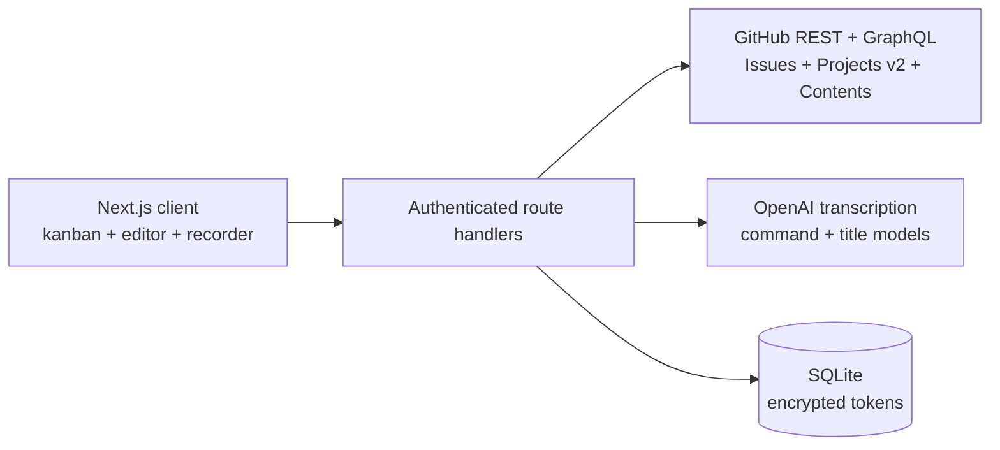

<div align="center">
  
  <h1>Git Master</h1>
  <p><strong>Voice-first GitHub issue and project management.</strong></p>
  <p>Say it. Edit it. Ship it.</p>
</div>

Git Master is a self-hosted workspace for creating, editing, commenting on, and moving GitHub issues without losing time to navigation. Dictate one fragment, type the next, attach a screenshot, then continue speaking—the editor preserves the current text and inserts every transcript at the caret.

> Українською: Git Master — open-source інструмент для швидкого керування GitHub Issues і Projects голосом, текстом та файлами. Українська мова підтримується з коробки.

## What works

- GitHub account, organization, and single-repository connections
- GitHub Projects v2 boards with their real Status field
- Repository-only kanban fallback backed by `status: …` labels
- Create, edit, and permanently delete issues; manage labels, state, status, and Markdown body
- Create and edit comments with text, voice fragments, images, and other files
- Multiple voice fragments inserted exactly at the current caret
- AI-generated issue titles that keep the description language
- Ukrainian, English, and mixed Ukrainian-English commands and issue dictation
- Configurable keyboard shortcuts with push-to-talk and hands-free voice modes
- Encrypted token storage, env-based app password, signed sessions, login rate limiting, and security headers
- Interactive demo board before a GitHub connection is added
- Docker image, SQLite persistence, CI, unit/integration tests, and Playwright browser tests

## Як користуватися Git Master

### Повний сценарій створення задачі голосом

1. Підключіть GitHub account, organization або окремий repository та виберіть потрібний репозиторій. Якщо для нього доступний GitHub Project, виберіть також project — дошка покаже його реальні колонки Status.
2. Відкрийте нову задачу кнопкою **New issue**, клавішами **Alt+N** або голосовою командою `Відкрий нову задачу` через **Alt+V**.
3. Коли редактор відкритий, знову натисніть **Alt+V** і продиктуйте перший фрагмент опису. Повторюйте це скільки завгодно разів — кожен наступний фрагмент буде додано до вже набраного тексту, а не замінить його.
4. Між голосовими фрагментами можна друкувати, редагувати Markdown, задавати заголовок, додавати labels, статус, картинки та інші файли.
5. Скажіть `Збережи і закрий задачу` або `Закрити та додати завдання`, щоб створити чи оновити issue. Для нової задачі без заголовка Git Master згенерує коротку назву з контексту опису.
6. Нова задача одразу з'явиться на дошці без ручного оновлення сторінки. Щоб відкинути чернетку, скажіть `Скасуй задачу` або `Close without saving`.

Наприклад, увесь цикл можна пройти однією клавішею:

```text
Alt+V → «Відкрий нову задачу»
Alt+V → «Потрібно додати валідацію форми реєстрації»
Alt+V → «Also cover the GitHub retry flow після expired token»
Alt+V → «Збережи і закрий задачу»
```

### Що робить Alt+V у різних контекстах

| Контекст | Поведінка |
| --- | --- |
| Дошка, редактор закритий | Розпізнає команду: відкрити задачу, знайти issue або оновити дошку |
| Редактор нової чи наявної задачі | Звичайне мовлення додається до опису як новий фрагмент |
| Редактор + явна команда заголовка, опису чи коментаря | Виконує вказану дію з продиктованим текстом |
| Редактор + явна команда Save | Зберігає issue на GitHub і закриває редактор |
| Редактор + явна команда Cancel | Закриває редактор без збереження чернетки |

Це навмисно контекстна поведінка. Фраза на кшталт `Додай можливість вибрати organization` у відкритому редакторі є текстом задачі. Дією вона стане лише у формі короткої, однозначної команди — наприклад `Додай цей task`, `Збережи задачу` або `Скасуй задачу`.

### Підтримувані голосові команди

Команди можна говорити українською, англійською або змішувати обидві мови в одному реченні.

| Дія | Приклади |
| --- | --- |
| Відкрити нову задачу | `Відкрий нову задачу`, `Створи новий таск`, `Create new issue` |
| Відкрити issue для редагування | `Редагувати задачу 432`, `Правити таск #432`, `Змінити ішю 432`, `Edit issue 432` |
| Видалити issue | `Видалити задачу 432`, `Знищити таск 432`, `Delete issue 432`, `Remove task 432` |
| Перенести між колонками | `Перенести задачу 432 з In progress в Review`, `Move issue 432 from Review to Done`, `Move task 432 to Backlog` |
| Встановити заголовок | `Встанови заголовок Додати кешування профілю`, `Set title to Fix broken login` |
| Додати до опису | `Додай в опис критерії приймання`, `Append to description add retry handling` |
| Підготувати коментар | `Додай коментар перевірено на staging`, `Add comment ready for review` |
| Зберегти й закрити | `Збережи задачу`, `Додай цей task`, `Закрити та додати завдання`, `Save this issue` |
| Скасувати | `Скасуй задачу`, `Відмінити завдання`, `Закрий без збереження`, `Close without saving` |
| Знайти задачі | `Знайди задачі авторизація`, `Search issues token refresh` |
| Оновити дошку | `Онови дошку з задачами`, `Refresh board` |

Для Edit/Delete/Move номер означає GitHub issue number, а не порядкове місце картки. У відкритому редакторі номер можна не казати в командах видалення та перенесення: `Видалити задачу` або `Перенести з Todo в Review` застосуються до поточного issue. Перенесення перевіряє початкову колонку, якщо її названо, і використовує точні Status-колонки активної дошки. Голосове видалення лише відкриває незворотне підтвердження — остаточне видалення не виконується мовчки.

### Push-to-talk і гарячі клавіші

- Утримуйте **Alt+V**, говоріть і відпустіть клавіші, щоб завершити запис та виконати команду або вставити транскрипт — як у рації.
- Двічі швидко натисніть **Alt+V**, щоб запис продовжувався без утримування. Наступне одиночне або подвійне натискання зупинить його.
- Натисніть **Alt+N**, щоб одразу відкрити нову задачу в активному репозиторії.
- Відкрийте **Settings → Гарячі клавіші**, щоб змінити обидві комбінації. Налаштування зберігаються локально в поточному браузері.
- Комбінація без Ctrl, Alt, Shift або Meta не перехоплюється під час набору в input, textarea, select чи editable-полі, щоб не заважати звичайному введенню.

Кнопка **Voice** безпосередньо в полі заголовка, опису або коментаря працює локально для цього поля: транскрипт вставляється в позицію курсора. Тому один документ можна природно складати з кількох голосових фрагментів, ручного тексту й файлів.

У **Settings → Голосові команди** можна змінити списки слів для редагування, видалення й перенесення, а також власні назви задачі. Варіанти розділяються комами або новими рядками. Наприклад, до Edit можна додати `підправити`, а до Delete — `прибрати`. Власні команди зберігаються в `localStorage` поточного браузера; кнопка **За замовчуванням** відновлює стандартні UA/EN синоніми.

### Створення, редагування, видалення та коментарі

- Нові issues підтримують Markdown, labels, state, Project Status та вкладення. Після створення локальна дошка оновлюється одразу.
- Наявний issue можна відкрити з дошки, змінити голосом або текстом, додати файли та зберегти назад у GitHub.
- Кнопка **Delete** фізично видаляє issue через GitHub після явного підтвердження. Операція незворотна та залежить від GitHub permissions підключеного користувача.
- Коментарі можна створювати й редагувати. До них дозволено по черзі додавати ручний текст, голосові фрагменти, картинки та інші файли.
- У кожному редакторі вкладення можна перетягнути мишкою, вибрати кнопкою **З диска** або вставити картинку зі clipboard через **Ctrl+V / ⌘V**. Звичайний текст із clipboard вставляється як текст.
- Файли завантажуються в `.git-master/uploads/issue-<number>/` через GitHub Contents API, тому залишаються доступними з GitHub і зберігаються в історії репозиторію.

### Українська, English і змішане мовлення

Мова розпізнається автоматично. Транскрипція спеціально підказує моделі очікувати українську, англійську та code-switching, зберігати технічні терміни, назви продуктів, файлів і code identifiers. Типовою моделлю є `gpt-4o-mini-transcribe`; її можна замінити через `OPENAI_TRANSCRIBE_MODEL`. Для голосу потрібен `OPENAI_API_KEY`.

## Quick start with Docker

Requirements: Docker 24+ and a GitHub personal access token.

```bash
git clone https://github.com/AgencyAI-one/GIT_Master.git
cd GIT_Master
cp .env.example .env
openssl rand -hex 32 # use as ENCRYPTION_KEY
openssl rand -base64 48 # use as APP_SECRET
docker compose up --build
```

Open [http://localhost:3000](http://localhost:3000) and sign in with `APP_PASSWORD` from `.env`. Add `OPENAI_API_KEY` to enable transcription, contextual title generation, and natural-language command interpretation. Core GitHub management still works without it.

## Local development

```bash
npm install
cp .env.example .env.local
npm run dev
```

Щоб запустити dev-сервер на порту 5173:

```bash
npm run dev -- --port 5173
```

Node.js 22+ is required; Node.js 24 is used in Docker and CI. In development only, Git Master falls back to the password `gitmaster`. Production refuses to start without `APP_PASSWORD`, a 32+ character `APP_SECRET`, and `ENCRYPTION_KEY`.

## Start, stop, restart and logs

The root scripts manage one local Git Master process and use port `5173` by default:

```bash
./start.sh dev       # Next.js development server with hot reload
./start.sh prod      # build and start the optimized production server
./stop.sh
./restart.sh         # preserve the current mode and port
./restart.sh prod    # switch to production mode
./logs.sh            # show the last 100 lines and follow new output
./logs.sh --no-follow 50
```

Pass a second argument to select another port, for example `./start.sh dev 3000`. The same defaults can be configured with `GIT_MASTER_MODE`, `GIT_MASTER_PORT`, and `GIT_MASTER_HOST`. Runtime PID, mode, port, and logs are stored under the ignored `.git-master-runtime/` directory. `stop.sh` validates that the saved PID belongs to this checkout before sending a signal.

Production mode always runs `npm run build`, copies `public` and static assets into Next.js's generated standalone bundle, and starts `.next/standalone/server.js`. Startup therefore fails early if the app or required production environment is invalid. Add secure `APP_PASSWORD`, `APP_SECRET`, and `ENCRYPTION_KEY` values to `.env` before using it.

## GitHub access

Git Master deliberately starts with a personal access token instead of a mandatory OAuth app. This keeps self-hosting simple and supports three scopes from the same UI:

| Connection | Visible repositories | Recommended token scope |
| --- | --- | --- |
| Account | Repositories available to the token | Select only the repositories you need |
| Organization | One organization's repositories | Select the organization and required repositories |
| Repository | Exactly one repository | Select one repository |

For a fine-grained token, grant:

- Metadata: read
- Issues: read and write
- Contents: read and write (required only for attachments)
- Projects: read and write (required only for Projects v2 status sync)

Organization Projects may also require organization approval. Classic tokens need `repo`, plus `read:org` and `project` where applicable. Always use the narrowest token possible.

## How attachments work

GitHub has no public issue-attachment upload endpoint. Git Master uses the supported Contents API instead:

1. Create or identify the issue.
2. Commit the file to `.git-master/uploads/issue-<number>/`.
3. Insert the resulting image or file link into the issue/comment as Markdown.

This makes attachments durable and visible from GitHub itself. Every upload is a small commit. Set `GITHUB_UPLOAD_BRANCH` if uploads should target a branch other than the repository default.

Every attachment-enabled editor—the issue description, a new comment, and an existing comment being edited—accepts files in three ways:

- drag one or multiple files directly over the editor and drop them on the highlighted target;
- press **З диска** and choose one or multiple files with the system file picker;
- copy an image or screenshot and press **Ctrl+V** or **⌘V** while the corresponding editor is focused.

Clipboard handling accepts images only, so ordinary pasted text keeps the browser's normal behavior. Selected files appear below the text with their name and size and can be removed before saving. Duplicate files are ignored, and each file is validated against the 10 MB upload limit immediately instead of failing after issue submission.

## Deletion and comment editing

Issue deletion uses GitHub's GraphQL `deleteIssue` mutation and requires explicit confirmation in the drawer. It is permanent and succeeds only when the connected GitHub identity has permission to delete that issue. Files previously committed to `.git-master/uploads/` remain in repository history.

Comment editing uses GitHub's issue-comment update endpoint. GitHub permits it for the comment author or an identity with sufficient repository write access. Existing comment text can be edited, extended by voice, and supplemented with new attachments.

## Voice workflow

Inside a title, description, or comment:

1. Put the caret where the new text belongs.
2. Press **Voice**, dictate, and press **Stop**.
3. Edit the transcript if needed and repeat anywhere in the text.

The floating microphone is tuned for Ukrainian, English, and mixed Ukrainian-English developer speech. Outside the issue editor it listens for commands. Once a new or existing issue is open, ordinary speech is appended to the description, so the same `Alt+V` shortcut can add as many consecutive fragments as needed. Explicit commands remain available:

```text
Відкрий нову задачу
Редагувати задачу 432
Видалити issue 432
Перенести таск 432 з In progress в Review
Встанови заголовок Додати кешування профілю
Додай в опис перевірити invalidation після logout
Додай коментар готово для staging
Опублікуй задачу
Збережи і закрий задачу
Скасуй задачу
Save this issue
Close without saving
Знайди задачі авторизація
```

In editor mode, phrases such as “Додай можливість вибрати organization” are treated as issue content, not as a command. Only short, explicit Save/Cancel/Title/Comment phrases trigger an action. Cancelling closes the drawer without writing the draft to GitHub.

### Push-to-talk and shortcuts

From anywhere on the board, hold **Alt+V** and speak, then release the keys to send the recording for transcription—like a walkie-talkie. Press **Alt+V** twice quickly to keep recording without holding the keyboard; press it once or twice again to stop. **Alt+N** opens a new issue in the active repository.

Open **Settings → Гарячі клавіші** to record different combinations. They are stored locally in the current browser. A shortcut without Ctrl, Alt, Shift, or Meta is ignored while focus is inside an input, textarea, select, or editable field, so normal typing remains safe.

The default transcription model is `gpt-4o-mini-transcribe`. See [Voice model decision](docs/VOICE.md) for the current price/quality comparison and how to select the higher-accuracy model.

## Architecture



The server is the only component that sees GitHub and AI credentials. See [Architecture](docs/ARCHITECTURE.md), [Security](docs/SECURITY.md), and [Voice](docs/VOICE.md).

## Configuration

| Variable | Required | Purpose |
| --- | --- | --- |
| `APP_PASSWORD` | Production | Shared password for the private workspace |
| `APP_SECRET` | Production | HMAC session secret, at least 32 characters |
| `ENCRYPTION_KEY` | Production | 64 hex characters recommended; encrypts GitHub tokens |
| `DATABASE_PATH` | No | SQLite file; default `./data/git-master.db` |
| `OPENAI_API_KEY` | For voice/AI | Server-side OpenAI API key |
| `OPENAI_TRANSCRIBE_MODEL` | No | Default `gpt-4o-mini-transcribe` |
| `OPENAI_TEXT_MODEL` | No | Default `gpt-4o-mini`; title and command routing |
| `GITHUB_API_URL` | No | Default `https://api.github.com`; supports GitHub Enterprise API roots |
| `GITHUB_UPLOAD_BRANCH` | No | Branch used for committed attachments |

## Verification

```bash
npm run lint
npm run typecheck
npm test
npm run test:e2e
npm run build
```

`npm run check` runs lint, types, unit/integration tests, and a production build. Playwright is separate because it requires browser binaries: `npx playwright install chromium`.

## API surface

All routes except `/api/health` and `/api/auth/login` require the signed app session.

| Area | Routes |
| --- | --- |
| Authentication | `/api/auth/login`, `/api/auth/logout` |
| Connections | `/api/connections`, `/api/connections/:id` |
| Workspace | `/api/github/repositories`, `/projects`, `/board`, `/status` |
| Issues | `/api/github/issues`, `/issues/:number`, `/issues/:number/comments`, `/issues/:number/comments/:commentId` |
| Files | `/api/github/attachments` |
| Voice | `/api/voice/transcribe`, `/title`, `/command` |

## Project status

This is the first production-ready foundation, not a hosted SaaS. The current authentication model is intentionally a single private workspace password. Multi-user accounts, GitHub App/OAuth installation, live WebSocket partial transcripts, and S3-compatible attachment storage are documented roadmap candidates—not hidden incomplete features.

Contributions are welcome. Read [CONTRIBUTING.md](CONTRIBUTING.md), our [Code of Conduct](CODE_OF_CONDUCT.md), and [Security Policy](SECURITY.md).

## License

[MIT](LICENSE) © 2026 AgencyAI-one and Git Master contributors.
