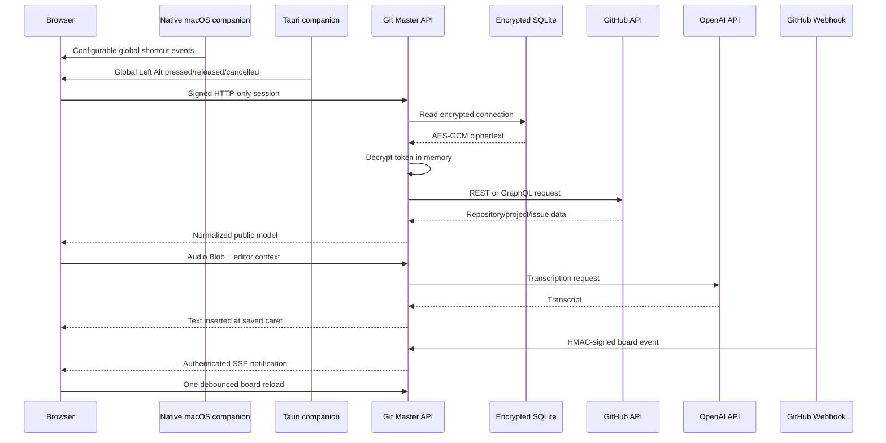

# Architecture

Git Master is a single-process Next.js application designed for self-hosting. It keeps operations simple without leaking provider credentials to the browser.

## Boundaries



The browser never receives `OPENAI_API_KEY`, `APP_SECRET`, `ENCRYPTION_KEY`, or a stored GitHub token.

## Source layout

```text
src/app/api/             Authenticated HTTP boundary
src/components/workspace Product UI and browser recording
src/lib/github.ts        GitHub REST/GraphQL adapter
src/lib/voice.ts         Transcription, title, and command adapter
src/lib/db.ts            SQLite connection repository
src/lib/auth.ts          Password sessions
src/lib/crypto.ts        AES-256-GCM token envelope
src/lib/github-webhook.ts Webhook verification and event normalization
src/lib/live-events.ts   Single-process SSE pub/sub and board matching
mac_xcode_app_shortcut/  Native macOS companion, Xcode project, and release scripts
src-tauri/               Optional cross-platform global-Left-Alt companion
tests/                   Unit, adapter, and browser tests
```

## GitHub model

Connections contain a token and a visibility constraint: account, organization, or repository. The constraint is enforced when repositories are listed; every downstream operation also carries an explicit `owner/repository` value.

For Projects v2, Git Master reads the project's single-select `Status` field and item values through GraphQL. Dragging a card updates that exact field. Without a selected Project, the board uses repository issues and maps these labels:

```text
status: backlog
status: in progress
status: review
status: done
```

Closed issues are always displayed as Done. Moving a Done issue back reopens it.

## Event-driven synchronization

The browser holds one authenticated `EventSource` connection to `/api/events`. GitHub sends organization ProjectV2 item changes or repository issue activity to `/api/github/webhook`; the route verifies the raw payload with the configured SHA-256 HMAC secret and emits only a normalized board-change notification. A bounded recent-event buffer and SSE `Last-Event-ID` cover connection and reconnect races. Matching clients debounce related deliveries and perform one uncached board read. SSE keep-alive comments preserve the connection but never query GitHub, so this is push notification plus on-demand refresh rather than polling.

The event hub is intentionally in process, matching Git Master's single-process self-hosting model. A multi-instance deployment must replace or bridge it with shared pub/sub. Organization ProjectV2 webhooks can target a board by exact project node ID. Repository issue events target the exact `owner/repository` name.

## Companion boundaries

Both desktop clients are companion shells, not second backends. They keep the normal signed web session in an operating-system WebView and send native key-state events into the same React command flow. Neither client reads SQLite, GitHub tokens, the OpenAI key, or the app password.

The Swift macOS companion stores its configured URL and shortcut bindings in `UserDefaults`, accepts remote HTTPS or loopback HTTP, and restricts microphone capture to the configured origin. Cross-origin navigation leaves its privileged WebView and opens in the default browser. The Tauri companion loads `GIT_MASTER_URL` and exposes no native IPC command to the remotely loaded page.

## Persistence

SQLite stores connection metadata and encrypted tokens. WAL mode allows concurrent reads while a connection is added or removed. The database is a runtime volume and must not be committed or baked into a container image.

Token envelopes use this versioned structure:

```text
v1.<12-byte-IV>.<GCM-auth-tag>.<ciphertext>
```

Changing `ENCRYPTION_KEY` makes existing tokens unreadable. Export or reconnect them before rotating the key; automatic key rotation is intentionally not implied.

## Failure behavior

- An issue is returned even when adding it to a Project fails; the UI surfaces a warning to prevent accidental duplicate creation.
- Status moves are optimistic and roll back if GitHub rejects the update.
- Natural-language command routing falls back to conservative local rules if the text model fails.
- Unknown speech never becomes a write action.
- Voice is optional; GitHub issue management remains available without an AI key.
